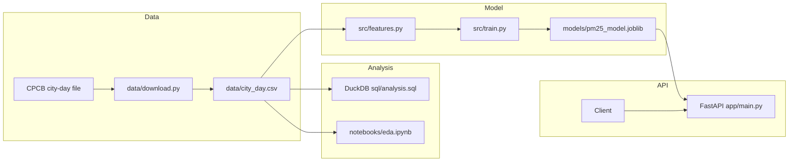
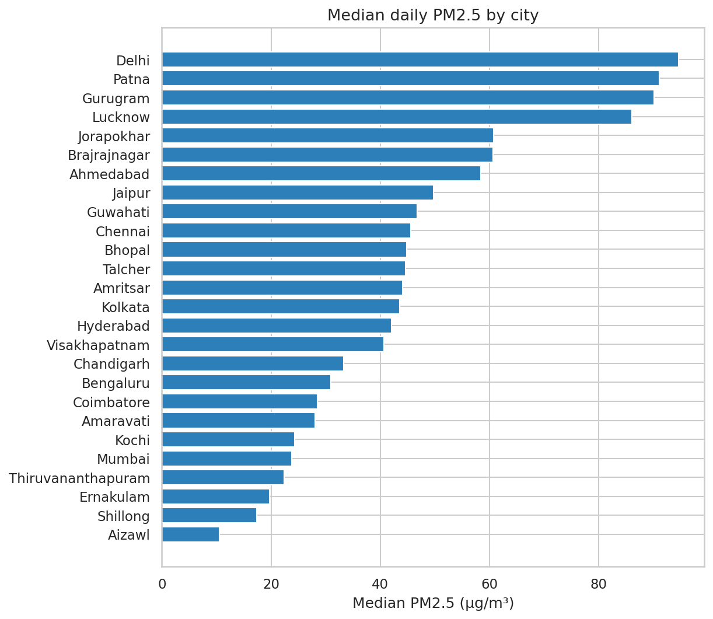
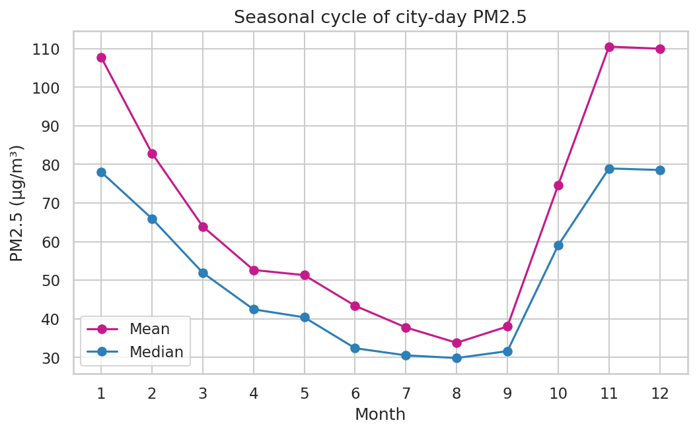
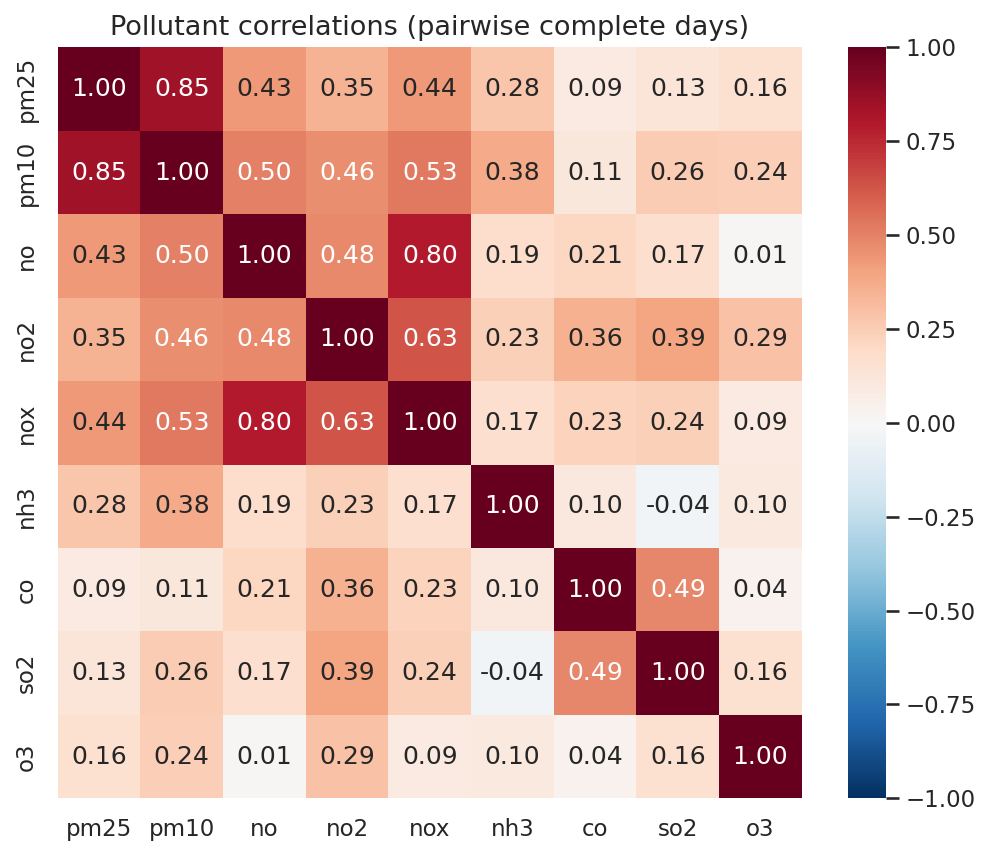

# India city-day PM2.5 predictor

Author: **Vineet Shukla**, 3rd-year B.Tech CSE. Portfolio project for data science and machine learning internships.

This repository forecasts **next-day PM2.5** for Indian cities from the public CPCB city-day file (2015-01-01 to 2020-07-01) and maps that concentration to the CPCB PM2.5 sub-index category. It is a historical model, not a live air-quality feed. Nothing here is deployed, and the repo contains no credentials.

The API serves a **random forest**, the trained model with the lowest test RMSE. A naive persistence baseline is still in the comparison. It is very strong on daily PM2.5 because of autocorrelation, and the trained models beat it only modestly.

## Architecture



`GET /health` and `POST /predict` are served by FastAPI. Interactive docs are at `/docs` (local default `http://127.0.0.1:8000/docs`).

## Dataset

| Item | Value |
| --- | --- |
| File | `city_day.csv` |
| Rows | 29531 |
| Cities | 26 |
| Dates | 2015-01-01 to 2020-07-01 |
| Measurements | CPCB, published by Rohan Rao (Kaggle user Vopani) |
| Kaggle dataset | [Air Quality Data in India (2015 - 2020)](https://www.kaggle.com/datasets/rohanrao/air-quality-data-in-india) |
| License | [CC0: Public Domain](https://creativecommons.org/publicdomain/zero/1.0/) |
| CPCB portal | [cpcb.nic.in](https://cpcb.nic.in/) |

Kaggle downloads require a login. `data/download.py` fetches the same `city_day.csv` from the public GitHub mirror [adityarc19/aqi-india](https://github.com/adityarc19/aqi-india) (`main` branch raw URL). No API key is used. The pinned SHA256 is `0d84b21c3e4878bbad8df362f2ab05f61ad959538dddf5918e714077ed3c1847`. The full file is about 2.5 MB, under the 20 MB cutoff, so it is committed. Re-check it with:

```bash
python data/download.py --check
```

Observed PM2.5 on this file has mean **67.45** µg/m³, median **48.57** µg/m³, and maximum **949.99** µg/m³. PM2.5 is missing on **15.57%** of rows. PM10 is missing on **37.72%**. There are **0** negative numeric readings. Expanding each city onto a daily calendar does not add rows: within each city's own span the published dates are already continuous (`daily_rows` 29531).

## How to run locally

Python 3.12. From the repository root:

```bash
python -m venv .venv
source .venv/bin/activate
pip install -r requirements.txt
pip install -r requirements-dev.txt   # only to re-execute the notebook
python data/download.py --check
python sql/run_analysis.py
python -m src.train
jupyter nbconvert --to notebook --execute --inplace notebooks/eda.ipynb
ruff check .
pytest -q
uvicorn app.main:app --host 127.0.0.1 --port 8000
```

`make test`, `make sql`, `make train`, and `make api` wrap the same commands. `src/train.py` overwrites `models/pm25_model.joblib`, `models/metadata.json`, `reports/metrics.json`, and the API example files. The numbers in this README were taken from those outputs after that run.

## SQL analysis

`sql/run_analysis.py` loads the CSV into DuckDB and runs the named queries in `sql/analysis.sql`. Results land in `reports/sql/`.

Seasons in those queries are the air-pollution grouping used in this project: Winter (Dec–Feb), Summer (Mar–May), Monsoon (Jun–Sep), Post-monsoon (Oct–Nov).

Highest mean PM2.5 is **Patna** at **123.50** µg/m³ (median 91.12, mean AQI 240.78, 1537 days with PM2.5). Lowest mean is **Aizawl** at **17.13** µg/m³. Aizawl's series is short and starts in 2020, so that rank is not a long climatology.

| City | Days with PM2.5 | Mean PM2.5 | Median PM2.5 | Mean AQI |
| --- | ---: | ---: | ---: | ---: |
| Patna | 1537 | 123.50 | 91.12 | 240.78 |
| Delhi | 2007 | 117.20 | 94.62 | 259.49 |
| Gurugram | 1525 | 117.10 | 90.15 | 225.12 |
| Lucknow | 1907 | 109.71 | 86.09 | 217.97 |
| Ahmedabad | 1381 | 67.85 | 58.37 | 452.12 |

Ahmedabad's mean AQI (452.12) sits far above its mean PM2.5 (67.85). The published AQI is not a rescaling of PM2.5 alone. The API category below is only the PM2.5 sub-index.

Seasonal means of PM2.5, all cities pooled:

| Season | Mean PM2.5 | Median PM2.5 | Days |
| --- | ---: | ---: | ---: |
| Winter | 100.24 | 74.56 | 6273 |
| Post-monsoon | 92.65 | 68.32 | 3870 |
| Summer | 55.95 | 44.49 | 7115 |
| Monsoon | 38.61 | 30.98 | 7675 |

**Winter** is the highest season at **100.24** µg/m³. Pairwise correlation of PM2.5 with PM10 is **0.846**. Correlation of PM2.5 with the published AQI is 0.659 (`reports/sql/pollutant_correlations.csv`).

Yearly means are not a clean trend. The city set grows from 9 cities in 2015 to 26 in 2020, and 2020 stops on 2020-07-01, so it misses most of the high-PM2.5 post-monsoon and winter:

| Year | Mean PM2.5 | Mean AQI | PM2.5 days | Cities |
| --- | ---: | ---: | ---: | ---: |
| 2015 | 83.32 | 212.46 | 1856 | 9 |
| 2016 | 92.22 | 197.15 | 2644 | 10 |
| 2017 | 86.03 | 181.47 | 3294 | 17 |
| 2018 | 69.23 | 182.68 | 5525 | 18 |
| 2019 | 58.96 | 156.52 | 7136 | 23 |
| 2020 | 43.91 | 113.52 | 4478 | 26 |

## Exploratory plots

`notebooks/eda.ipynb` is executed and stores its outputs. It uses the same `clean` / `add_features` functions as training. Distributions and correlations use observed values. Median imputation of auxiliary features happens only inside the training pipeline, fit on the training period.

Delhi has the highest **median** PM2.5 at **94.62** µg/m³. Aizawl has the lowest median at **10.48**. Patna leads on the mean, which is the heavier tail, not the median.



The monthly mean peaks in November at **110.53** µg/m³ and is lowest in August at **33.78** µg/m³.





Other saved figures: `reports/figures/missingness.png`, `reports/figures/pm25_distribution.png`, `reports/figures/city_timeseries.png`. The descriptive summary written by the notebook is `reports/eda_summary.json`.

## Modeling

Target: PM2.5 on date *t* for a city, in µg/m³. Features use only dates before *t*:

- PM2.5 lags at 1, 2, 3, 7, and 14 days, the 7-day and 14-day rolling mean and the 7-day rolling standard deviation of past PM2.5, and the one-day change `lag_1 - lag_2`
- Lag-1 of PM10, NO2, NO, CO, SO2, and O3
- Calendar fields of the target date (month, day of week, month sine/cosine), which are known when the forecast is issued
- City, one-hot encoded inside the sklearn pipelines

Same-day PM2.5, same-day AQI, and `AQI_Bucket` are not features. A supervised row must have both the target and yesterday's PM2.5. That leaves **24644** rows. Other gaps are median-imputed inside the pipeline, and the imputer is fit on the training rows only.

Split: one cutoff at the last 20% of supervised dates. Training dates are strictly earlier. Cities with no rows before the cutoff are removed from the test score, because a city effect cannot have been learned. Excluded cities: Aizawl, Bhopal, Chandigarh, Coimbatore, Ernakulam, Kochi, Shillong. The scored model covers **19 cities**.

| Split | Dates | Rows |
| --- | --- | ---: |
| Train | 2015-01-02 to 2019-05-26 | 15760 |
| Test | 2019-05-27 to 2020-07-01 | 7288 |

Cutoff date: **2019-05-27**.

Hyperparameters were fixed before looking at the test scores. Random forest uses 80 trees, `max_depth=10`, `min_samples_leaf=8`, `random_state=42`. HistGradientBoosting uses `max_iter=200`, `learning_rate=0.06`, `max_depth=6`, `min_samples_leaf=20`, `l2_regularization=0.1`. The naive baseline predicts `pm25_lag_1`.

Test metrics from `reports/metrics.json` (sklearn 1.5.2):

| Model | MAE | RMSE | R² |
| --- | ---: | ---: | ---: |
| naive_persistence | 11.880 | 21.085 | 0.783 |
| linear_regression | 12.533 | 20.579 | 0.793 |
| random_forest | 11.962 | 20.153 | 0.802 |
| hist_gradient_boosting | 12.473 | 20.279 | 0.799 |

Selection rule: **lowest test RMSE among trained models**. `naive_persistence` is scored and kept in the table, and it is not eligible to be served. Ties break on higher R², then lower MAE. Under that rule **random_forest** wins (RMSE 20.153, R² 0.802). `python -m src.train` writes it to `models/pm25_model.joblib` with `models/metadata.json`. The compressed artifact is **1169745** bytes.

Persistence still has the lowest MAE (11.880 versus 11.962 for the forest). The forest's RMSE gain over persistence is 20.153 versus 21.085, and its R² gain is 0.802 versus 0.783. That is a modest lift. Day-to-day PM2.5 is strongly autocorrelated, so yesterday's value is already a hard baseline. Linear regression and gradient boosting also beat persistence on RMSE and R², and both lose to the forest on all three metrics.

On the random forest's test predictions, the period before the 2020-03-25 lockdown marker (5507 rows) has MAE 13.164, RMSE 22.061, R² 0.800. From 2020-03-25 through 2020-07-01 (1781 rows) MAE is 8.246, RMSE 12.537, and R² is 0.588. Absolute error fell while R² fell. Levels were lower in that window, so an error in µg/m³ got smaller even though the model explains less of the remaining variation. This slice is not a second model selection.

Worked example, one held-out day, not a summary of the test metrics. Delhi on 2019-05-27: yesterday's PM2.5 (2019-05-26) was 55.13, the forest predicted **63.88**, and the observed PM2.5 was **64.66**. The PM2.5 sub-index for 63.88 is 112.9, category **Moderate**. The request body is `reports/api_example_request.json`.

## API

```bash
curl -s http://127.0.0.1:8000/health
```

```json
{"status":"ok","model_name":"random_forest","n_cities":19,"target":"pm25"}
```

```bash
curl -s -X POST http://127.0.0.1:8000/predict \
  -H 'Content-Type: application/json' \
  --data-binary @reports/api_example_request.json
```

```json
{"city":"Delhi","date":"2019-05-27","predicted_pm25":63.88,"aqi_subindex":112.9,"aqi_category":"Moderate","model_name":"random_forest","aqi_basis":"CPCB PM2.5 sub-index"}
```

Those two JSON bodies are the responses from this service on 127.0.0.1:8000, using the committed example request. `/docs` is the Swagger UI. `/redoc` is the ReDoc view. Unknown cities, negative concentrations, and a history that skips the calendar day before the forecast date return HTTP 422. Send up to 60 prior days; 14 complete days are enough to fill the rolling features. Pollutant fields other than `pm25` may be null.

The category uses CPCB 24-hour PM2.5 bands: Good ≤30, Satisfactory ≤60, Moderate ≤90, Poor ≤120, Very Poor ≤250, otherwise Severe. The numeric sub-index is the published piecewise linear map, extrapolated past 380 µg/m³ with the last segment's slope. It is not the multi-pollutant AQI.

## Tests and CI

```bash
ruff check .
pytest -q
```

Tests cover calendar lags (a missing day must not be filled by the previous observation), the time split, CPCB breakpoints, the dataset checksum, the DuckDB queries, model loading against the saved example, and `/health` plus `/predict` through FastAPI's `TestClient`. `tests/test_readme.py` checks that the metrics, SQL highlights, and EDA summary above are the strings written by those runs.

GitHub Actions (`.github/workflows/ci.yml`) runs Ruff and pytest on push and on pull requests, with Python 3.12.

## Deployment readiness

This project is not deployed. No cloud account is used from this repository. Two manual targets are documented so the same image can be shipped later.

### Hugging Face Space (Docker SDK)

Space owner: **Pandaisop**. The container listens on port **7860**. Copy `deploy/huggingface/README.md` to the Space repository root. Its front matter is:

```yaml
---
title: India PM2.5 Predictor
emoji: 🌫️
colorFrom: blue
colorTo: green
sdk: docker
app_port: 7860
pinned: false
---
```

Manual steps:

1. Create a Space at [huggingface.co/new-space](https://huggingface.co/new-space) under the account **Pandaisop**. Choose SDK **Docker**, not Gradio or Streamlit. Pick a name, for example `india-pm25-predictor`. Leave the Space empty.
2. Clone it: `git clone https://huggingface.co/spaces/Pandaisop/india-pm25-predictor`.
3. Copy into that clone: `Dockerfile`, `requirements.txt`, `app/`, `src/`, `models/`, and `deploy/huggingface/README.md` renamed to `README.md` at the Space root. The model files must be included. The CSV is not required at serving time.
4. From the Space clone, commit and push to `main` on the Hugging Face remote. The Space build runs `docker build` and starts the container.
5. Confirm the app is listening on port 7860. The Space page will show the build logs. After the build is healthy, open `https://huggingface.co/spaces/Pandaisop/india-pm25-predictor` and the app URL `https://pandaisop-india-pm25-predictor.hf.space/docs`.
6. Check `GET /health`, then `POST /predict` with `reports/api_example_request.json`.

The image runs as uid 1000, which Hugging Face Docker Spaces expect. `ENV PORT=7860` is the default. Local check, still not a deploy:

```bash
docker build -t aqi-predictor .
docker run --rm -p 7860:7860 aqi-predictor
```

Then open `http://127.0.0.1:7860/docs`.

### Google Cloud Run

Cloud Run sets `PORT` (8080 by default). The image command is `uvicorn app.main:app --host 0.0.0.0 --port ${PORT}`, so the same Dockerfile follows that variable. From a machine where you are already logged in with `gcloud` (this repo does not log in for you):

```bash
gcloud run deploy aqi-predictor \
  --source . \
  --region asia-south1 \
  --port 8080 \
  --allow-unauthenticated
```

`--source .` builds the Dockerfile in this directory. Do not pass API keys, and do not put a service account file in the repo. After deploy, call the printed service URL at `/health` and `/docs`. To keep the service private, drop `--allow-unauthenticated` and invoke it with your own identity instead.

## Limitations

- The series ends on 2020-07-01. There is no live CPCB pull in this project.
- City-day means hide neighbourhood spikes.
- Weather, fire counts, and traffic are not in the file, so the model cannot represent ventilation or emissions directly.
- The horizon is one day. Multi-day forecasts would need a recursive or direct strategy and a fresh evaluation.
- The returned category is the PM2.5 sub-index, not the official AQI (the max of pollutant sub-indices). Ahmedabad is the reminder: mean AQI 452.12 with mean PM2.5 67.85.
- Seven cities never appear before the cutoff, so they are absent from `/predict`.
- PM10 is missing on 37.72% of raw rows, so its lag is often imputed.
- The 2020 lockdown sits inside the test window. The MAE drop on that slice is not evidence that the forest learned the lockdown.
- Yearly averages mix a changing set of cities with a partial final year.

## Interview notes

**Why a time-based split.** Consecutive days in the same city are strongly dependent. A random row split would put 26 May in training and 27 May in test, or the reverse, and the model would be scored on neighbours it had already seen. The cutoff is one date, 2019-05-27. Every training row is earlier. Calendar fields of the target day are allowed, because the date being forecast is known when you issue the forecast. Same-day pollutants are not.

**Why the API serves a random forest, and why the baseline still matters.** The served model is the trained model with the lowest test RMSE. That is the random forest (RMSE 20.153, R² 0.802). Persistence is not in that contest, and it still wins MAE (11.880 versus 11.962) because daily PM2.5 is strongly autocorrelated: tomorrow looks a lot like today. The forest, the linear model, and gradient boosting beat persistence on RMSE and R², and only by a modest amount. The comparison table stays in the README so that gap is visible. The forest is capped at 80 trees and depth 10 so the artifact stays about 1.1 MB (1169745 bytes), well under a 50 MB limit.

**What the feature code refuses to do.** Lag 1 is the previous calendar day. If that day is missing, the lag is missing. It is not the previous non-null measurement. Rolling means are computed after `shift(1)`, so today's PM2.5 cannot leak into its own features. Median imputation is inside the sklearn pipeline and is fit on the training fold only.

**What I would do next, on a validation slice cut from the training period, not on this test set.** Add meteorology (wind, boundary-layer height, temperature) and stubble-burning or fire counts for the Indo-Gangetic cities. Try a Delhi-region model separately from a south-India model. Score pinball loss or prediction intervals, not only MAE. Evaluate a 3-day horizon explicitly. Use station-level CPCB files if a no-login mirror of those larger tables is available. Explain the forest with SHAP if a later validation slice shows it beating persistence on MAE by a margin that matters in µg/m³. Recheck Ahmedabad's AQI against the raw sub-indices before treating that column as a label.

## Layout

```text
app/main.py                 FastAPI app
src/features.py             cleaning, lags, time split
src/train.py                fit, score, save
src/inference.py            request to prediction
src/aqi.py                  CPCB PM2.5 sub-index
data/download.py            checksum and mirror download
data/city_day.csv           full CPCB city-day extract
sql/analysis.sql            DuckDB queries
notebooks/eda.ipynb         executed EDA
reports/figures/            plots
reports/metrics.json        model comparison
models/pm25_model.joblib    selected model
deploy/huggingface/README.md  Space front matter
.github/workflows/ci.yml    ruff and pytest
Dockerfile                  port 7860, uid 1000
```
